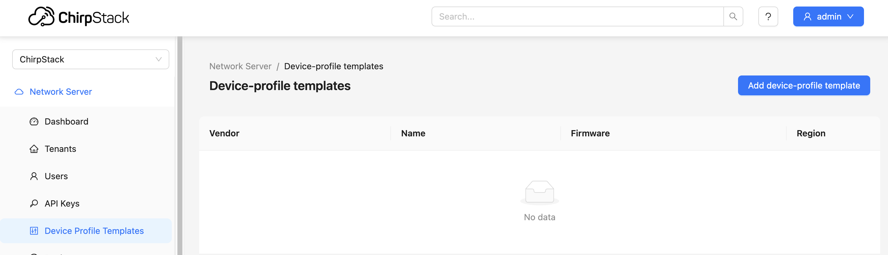

## Table of Contents

1. [Deploy the Stack](#step-1-deploy-the-stack)
2. [Handle MQTT Connection Errors](#step-2-handle-mqtt-connection-errors)
3. [Restart the Stack](#step-3-restart-the-stack)
4. [Verify Successful Deployment](#step-4-verify-successful-deployment)
5. [Change Default Password](#step-5-change-default-password)
6. [Import Device Profiles](#step-6-import-device-profiles)

---

## Step 1: Deploy the Stack

### 1.1 Access Portainer

Navigate to your OptixEdge Portainer interface:
```
http://<optixedge-ip>:9000
```

### 1.2 Create the Stack

1. Click **Stacks** in the left sidebar
2. Click **Add stack** button
3. Name your stack: `chirpstack`
4. Add the repository:
   - **Repository URL**: `https://github.com/asqi-carter/chirpstack-docker-Optix-Edge`
   - **Repository reference**: refs/head/master
   - **Compose path**: docker-compose.yml
   
   - or you can paste `docker-compose.yml` through the web editor

### 1.3 Configure Environment Variables (Optional)

Add any optional environment variables. For a quick start, you can leave this blank to use defaults.

See `.env.example` for available options:
- `CHIRPSTACK_REGION` - Default: `eu868`
- `CHIRPSTACK_NETWORK_ID` - Default: `000000`
- `CHIRPSTACK_API_SECRET` - Auto-generated if not provided


### 1.4 Deploy

Click **Deploy the stack** and wait for all containers to start.

**Expected behavior:**
- Most containers will show status "Running"
- `config-init` will show "Exited" (this is normal)

---

## Step 2: Handle MQTT Connection Errors

### 2.1 Check ChirpStack Logs

After initial deployment, check the `chirpstack-server` container logs:

1. Click **Containers**
2. Click `chirpstack-server`
3. Click **Logs**

**You will likely see MQTT connection errors:**


**This is expected on first deployment!** It's a timing issue where ChirpStack starts before Mosquitto is fully ready.

---

## Step 3: Restart the Stack

To resolve the MQTT connection errors, restart the entire stack:

### 3.1 Stop the Stack

1. Go to **Stacks**
2. Click your `chirpstack` stack
3. Click **Stop**
4. Wait for all containers to stop (status will show "Stopped")


### 3.2 Start the Stack

1. Click **Start**
2. Wait for all containers to start


---

## Step 4: Verify Successful Deployment

### 4.1 Check ChirpStack Logs Again

After restarting, check the `chirpstack-server` logs again:

1. Go to **Containers**
2. Click `chirpstack-server`
3. Click **Logs**

**The logs should now be clean with no MQTT errors:**


### 4.1 Access the Web UI

Open your web browser and navigate to:
```
http://<optixedge-ip>:8080
```

**Default credentials:**
- Username: `admin`
- Password: `admin`

---

## Step 5: Change Default Password

**IMPORTANT:** Change the default admin password immediately!

### 5.1 Navigate to User Settings

After logging in:

1. Click the user icon in the top right
2. Select **Change password** or **Profile**

### 5.2 Update Password

1. Enter current password: `admin`
2. Enter new secure password
3. Confirm new password
4. Click **Submit**


---

## Step 6: Import Device Profiles

ChirpStack can import pre-configured device profiles from The Things Network's lorawan-devices repository. This enables automatic codec configuration for hundreds of commercial LoRaWAN sensors.

### 6.1 Before Import

The device profile templates section will be empty:



### 6.2 Access Container Console

1. In Portainer, go to **Containers**
2. Click `chirpstack-server`
3. Click **Console**
4. Select:
   - **Command:** `/bin/sh`
   - **User:** `root` (type this in even if it looks like it's there)
5. Click **Connect**


### 6.3 Run Import Command

In the container console, run:

```bash
apk add --no-cache git && \
git clone https://github.com/brocaar/lorawan-devices /tmp/lorawan-devices && \
chirpstack -c /etc/chirpstack import-legacy-lorawan-devices-repository -d /tmp/lorawan-devices
```

**What this does:**
1. Installs git in the container
2. Clones the lorawan-devices repository
3. Imports all device profiles into ChirpStack

### 6.4 Monitor Import Progress

The import will take a few minutes. You'll see output like:


Look for messages like:
```
INFO chirpstack::cmd::import_legacy_lorawan_devices_repository: Reading profile
INFO chirpstack::storage::device_profile_template: Device-profile template upserted
```

### 6.5 Wait for Completion

The import will process hundreds of devices. Be patient!


### 6.6 Verify Import

Once complete, refresh the ChirpStack web UI and navigate to **Device-profile templates**:


You should see hundreds of device profiles organized by vendor:
- Adeunis
- Dragino
- Elsys
- Milesight
- RAKwireless
- Sensecap
- And many more...

---

